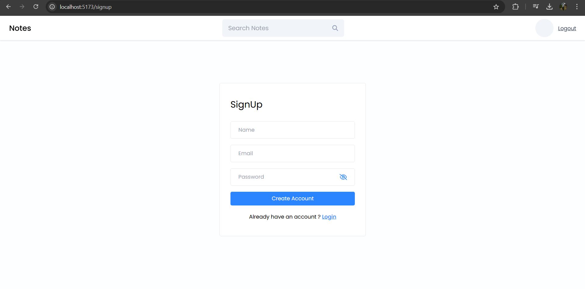
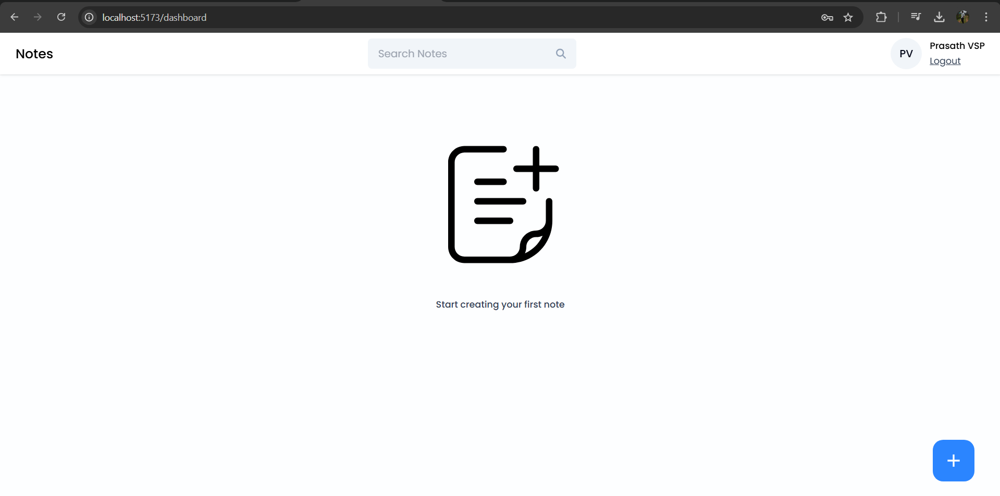
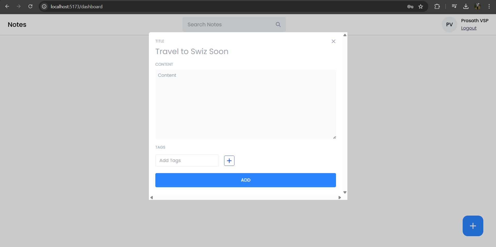
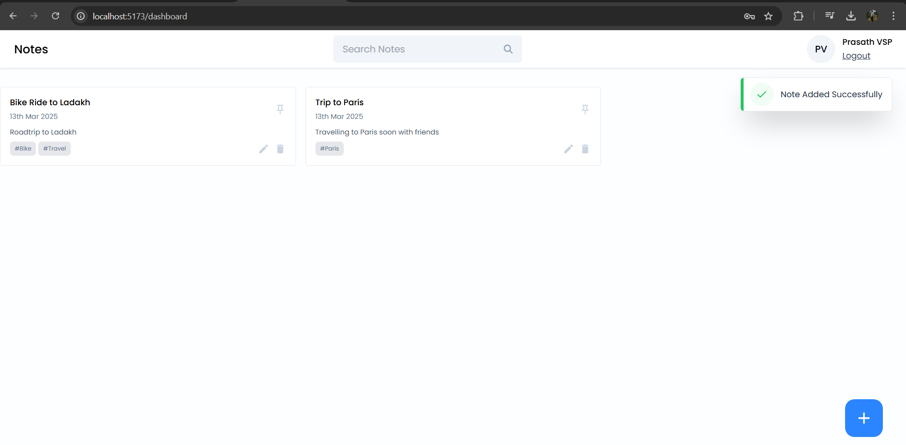
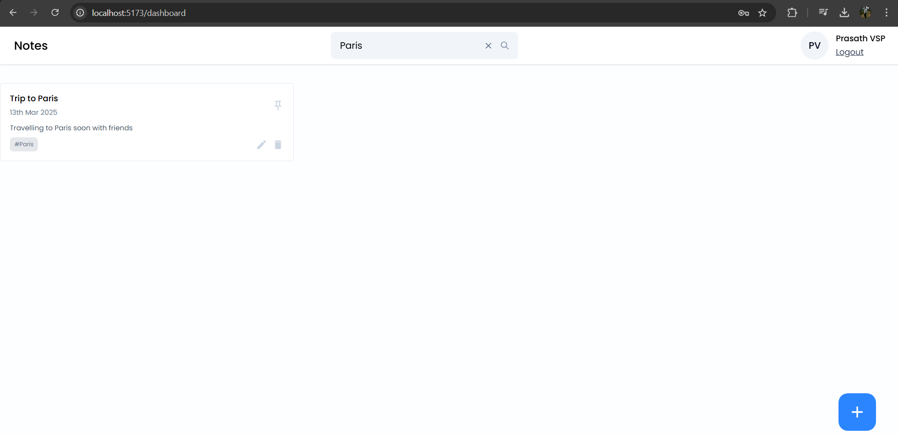

# Notes App

This is a full-stack Notes App using **React (frontend)**, **Node.js & Express (backend)**, and **MongoDB (database)**.  
User authentication is handled with **JWT (JSON Web Token)**.

## Features

- **User Authentication** (Login & Sign-up)
- **Add Note**
- **Delete Note**
- **Update Note**
- **Pin Note**
- **Search Notes**

## Tech Stack

- **Frontend**: React.js
- **Backend**: Node.js, Express.js
- **Database**: MongoDB
- **Authentication**: JWT

